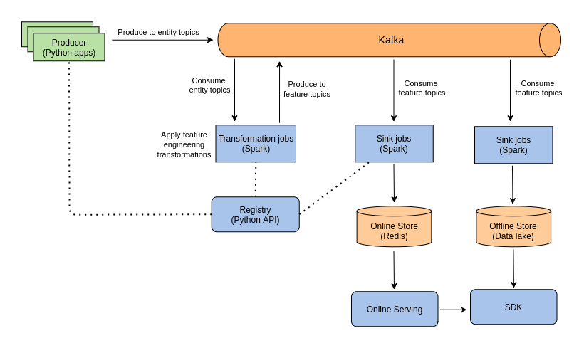

# Feature Store

Feature Store provides a centralized location to store and document features that will be used in machine learning models and can be shared across projects. The image below presents an ideal architecture proposed for building a streaming feature store that is able to calculate features using a streaming platform, and make them available to the data scientists on dev and prod environments.



The solution currently implemented contains only the following components:

* [Producer](./producer/README.md): applications producing entities to the kafka. 
* [Registry](./registry/README.md): repository of the schemas created on the pipeline stages.
* [Kafka](https://kafka.apache.org/): streaming platform used to enable a high-performance data pipeline.
* [Transformations](./transformations/README.md): spark jobs to transform the entities produced by applications into features used by ML models.
* [Sinks](./sinks/README.md): application that consumes the feature topics and ingest them in the online store.
* [Redis](https://redis.io/): in-memory data structure store, used as a online storage layer.


## Requirements

* docker >= 1.13.0
* docker compose >= 3
* make (making your life easier with makefiles)


## Getting Started

This project can be easily started using the command below.

```bash
make start
```

This command could take a few minutes since the docker images will be either pulled or built for the following services: Zookeeper, Kafka, Kafdrop, Redis, Transformations, and Sinks. You can follow the service logs using the command below.

```bash
make logs
```

After the services are running, you can access the management UI in order to make sure everything is fine.

* [Kafdrop's ui](http://localhost:9000)
* [Transformations' spark ui](http://localhost:4040/StreamingQuery)
* [Sinks' spark ui](http://localhost:4050/StreamingQuery)

Once everything is fine, let's run the producers.

```bash
make produce-orders
```
